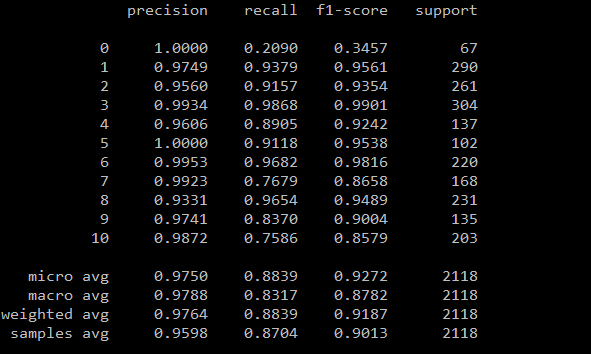
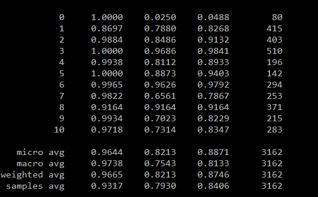
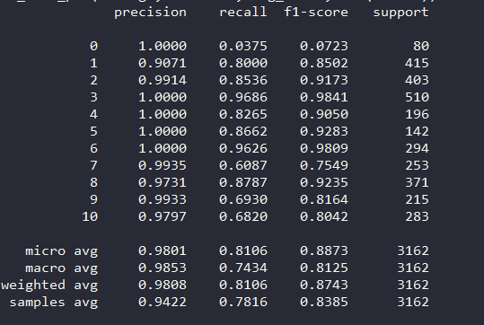
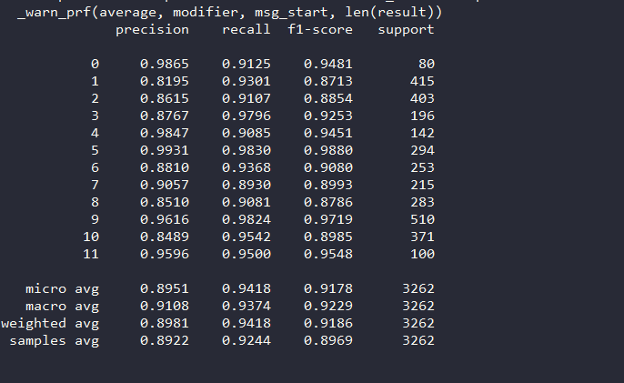

## 多标签学习（multi-label learning）

### 问题和难点

1. 数据集构建困难，各种标签的正负比例分布难控制，很容易出现数据不平衡
2. 数据标注的过程总很容易出现漏标注的情况。主要原因包含：标签的类别过多，容易遗漏；文本信息可能比较隐晦，需要推断标签类型

### 解决方案

- 逐步构建训练集，由易到难，逐步添加负样本
- 优化模型的loss类型，例如focal loss，asymmetric loss等，提升模型的能力
- 采用主动学习的方式，逐步迭代优化训练集
- 标题数据的相似度较大，重复部分较多，采用sim—hash选取合适的训练集

## 试验记录

### 第一版本模型输出结果

训练集：初版训练集，由规则模块构造标签   
测试集：初版测试集，由规则模块构造标签，并进行简单整理  
数据集特点: 大多数商品标题中显示的出现类别信息  

### 第二版本模型输出结果

### 第三版本模型输出结果

focal loss  

asymmetric_loss

 python -m task_compose.task_classification.albert.task_albert_ml_classification \
 --train_data=data/train_data/train.txt \
 --dev_data=data/train_data/test.txt \
 --labels_name=data/train_data/label.pickle \
 --loss_type=asymmetric_loss \
 --output_root=output \
 --epochs=10

