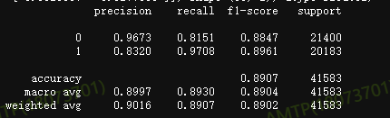
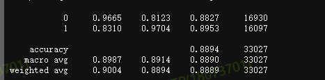

## 1. 参数清洗项目,二分类

train:   task_train_param_cleaning.py robert_wwm_ext
集成了RoBERTa和BERT-wwm的优点，对两者进行了一个自然的结合.需要注意的是，该模型并非原版RoBERTa模型，只是按照类似RoBERTa训练方式训练出的BERT模型，即RoBERTa-like BERT train.sh :
python -m task_compose.task_classification.roberta_ww_ext.task_train_param_cleaning \
--bert_mode=/home/nlpbigdata/net_disk_project/zhubin/nlpprogram_data_repository/chinese-roberta-wwm-ext \
--train_data=/home/nlpbigdata/net_disk_project/zhubin/product_kg/seed_value/df_train_v2.txt \
--dev_data=/home/nlpbigdata/net_disk_project/zhubin/product_kg/seed_value/df_test_v2.txt \
--batch_size=32 --epochs=2 --smooth=0.1 --loss_type=ce

验证    
python -m task_compose.task_classification.roberta_ww_ext.task_eval_param_cleaning --saved_mode=/home/nlpbigdata/net_disk_project/zhubin/product_kg/seed_value/roberta_ml.h5 --infer_data=/home/nlpbigdata/net_disk_project/zhubin/product_kg/seed_value/df_test.txt --bert_model=/home/nlpbigdata/net_disk_project/zhubin/nlpprogram_data_repository/chinese-roberta-wwm-ext
##2. 初步结果

