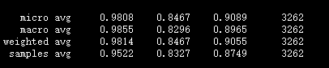
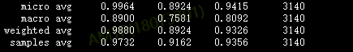
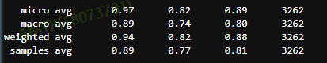
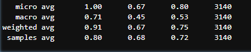
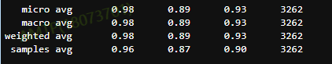
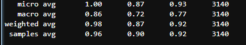
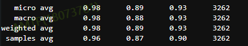
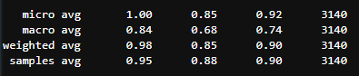

### Class-incremental Learning via Deep Model Consolidation
基于模型联合的方式解决增量学习问题

old model 的f1值  

incremental model 的f1值  

第一次实验:   
实验参数：  
python -m task_compose.deep_model_consolidation.task_consolidation_train \
  --output_root=output_consolidated \
  --train_data=/home/nlpbigdata/net_disk_project/zhubin/tmpdir/distill_data.txt \
  --bert_model=/home/nlpbigdata/net_disk_project/zhubin/nlpprogram_data_repository/bert_resource/albert_tiny_zh_google \
  --old_teacher_model_path=output_old/model/albert_ml.h5 \
  --incremental_teacher_model_path=output_incremental/model/albert_ml.h5 \
  --epochs=30 \
  --batch_size=8 \
  --lr=1e-5 \

old 模型   

incremental 模型 

第二次实验:  
python -m task_compose.deep_model_consolidation.task_consolidation_train \
  --output_root=output_consolidated \
  --train_data=/home/nlpbigdata/net_disk_project/zhubin/tmpdir/distill_data.txt \
  --bert_model=/home/nlpbigdata/net_disk_project/zhubin/nlpprogram_data_repository/bert_resource/albert_tiny_zh_google \
  --old_teacher_model_path=output_old/model/albert_ml.h5 \
  --incremental_teacher_model_path=output_incremental/model/albert_ml.h5 \
  --epochs=50 \
  --batch_size=8 \
  --lr=5e-5 \

old model  

incremental model  

第三次实验：
python -m task_compose.deep_model_consolidation.task_consolidation_train \
  --output_root=output_consolidated \
  --train_data=/home/nlpbigdata/net_disk_project/zhubin/tmpdir/distill_data_v2_18w.txt \
  --bert_model=/home/nlpbigdata/net_disk_project/zhubin/nlpprogram_data_repository/bert_resource/albert_tiny_zh_google \
  --old_teacher_model_path=output_old/model/albert_ml.h5 \
  --incremental_teacher_model_path=output_incremental/model/albert_ml.h5 \
  --epochs=20 \
  --batch_size=64 \
  --lr=1e-4

old model   

incremental model   

性能有点下降